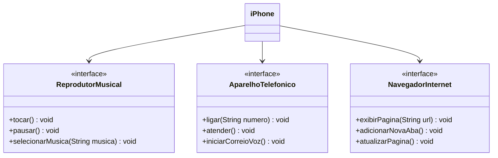

## Desafio DIO - Java Básico POO

Funcionalidades a Modelar

**Reprodutor Musical:**
Métodos: tocar(), pausar(), selecionarMusica(String musica)

**Aparelho Telefônico:**
Métodos: ligar(String numero), atender(), iniciarCorreioVoz()

**Navegador na Internet:**
Métodos: exibirPagina(String url), adicionarNovaAba(), atualizarPagina()

**Objetivos:**
1. Criar um diagrama UML que represente as funcionalidades descritas acima.
2. Implementar as classes e interfaces correspondentes em Java (Opcional).

